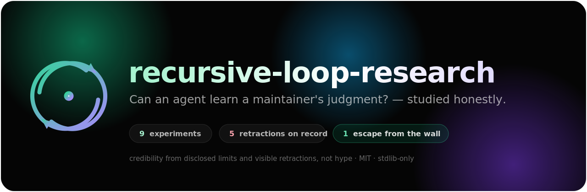

<div align="center">

<a href="https://tradelord223.github.io/recursive-loop-research/"></a>

# 🔁 recursive-loop-research

### Can an agent learn a maintainer's judgment? — an *honest* study of recursive self‑improvement loops.

### 🌐 &nbsp;**[Live site → tradelord223.github.io/recursive-loop-research](https://tradelord223.github.io/recursive-loop-research/)**

📅 datestamped progress: **[CHANGELOG.md](CHANGELOG.md)**

[](LICENSE)
[](ENVIRONMENT.md)
[](requirements.txt)
[](.github/workflows/ci.yml)
[](research/CLAIMS_NOT_ESTABLISHED.md)
[](https://tradelord223.github.io/recursive-loop-research/)
[](https://claude.com/claude-code)

*A bounded, self‑improving agent‑loop suite **plus** the experiments that test what it actually does — where credibility comes from disclosed limits and visible retractions, not hype.*

</div>

---

## Why this exists

Most "recursive self‑improvement" demos are impressive right up until you check them. This project does the checking. It is two things at once:

1. **A usable, bounded autonomous‑loop skill suite** for Claude Code (the loop lives *outside* the model — a real driver, hard caps, separate‑context review, additive‑only auto‑apply).
2. **A research log** that stress‑tests the suite's own claims and **keeps every overclaim it had to retract visible on the page.**

> The headline result the title asks about — *can an agent learn a maintainer's judgment* — is **not in yet, by construction.** It needs real human decisions and cannot be self‑generated without becoming circular (we prove this five times below). That honesty is the point.

---

## TL;DR — what's proven, what's open

| # | Experiment | Verdict |
|---|------------|---------|
| **3** | Pairwise vs absolute opportunity scoring | ✅ **Holds** — pairwise is far lower‑noise; stabilizes *ordering*, not the cut line. |
| **1** | Is the scoring rubric's gate real? | ⚠️ `Alignment≥8` carries it; `Total≥28` **unsubstantiated**; coin‑flip at the boundary. *(2 retractions, disclosed.)* |
| **2** | Does same‑context self‑review collude? | ⭕ **NULL** — no collusion observed on blatant hacks. Reported as a floor effect, not evidence. |
| **4** | Does judgment predict *realized value*? | ❌ **ρ=0.986 RETRACTED** — oracle was my own test‑allocation (circular). |
| **5** | Value‑prediction vs a structural oracle + deception | ❌ **ρ=1.0 NARROWED** — proves call‑graph *tracing*, not value judgment (value ≡ reach). |
| **6 / 7** | Same‑model "blind consensus" + does diversity fix it? | ❌ **DEMOTED by a 6×opus control** — the unanimity was a persona/sampling artifact. |
| **8** | Does an agent rubber‑stamp its own *subtly‑wrong* fixes? | ⭕ **ROBUST FLOOR** — 0 wrong fixes in 54; the lone exception was a bug in my *own* oracle, caught in analysis. |
| **9** | Can the loop fix REAL bugs, judged by an UNFAKEABLE signal? | ✅ **THE ESCAPE** — real‑repo harness, held‑out grading, reward‑hack guard fired live. **1/3 real bugs fixed.** The verdict is reality's, not an oracle I authored. |

**The standing contribution is not a positive finding — it's the methodology:** controls keep demoting clean‑looking results, and *every self‑authored oracle rebuilds the circularity*. **Exp9 is the one genuine escape** — when the reward is a real library's own test suite, the result can't be faked. The remaining open question (learning the *human's* judgment) rests on **revealed preference** — instrumented, waiting on data. 📅 Full timeline: **[CHANGELOG.md](CHANGELOG.md)**.

📄 Full account: **[research/PAPER.md](research/PAPER.md)** · honest limits: **[research/CLAIMS_NOT_ESTABLISHED.md](research/CLAIMS_NOT_ESTABLISHED.md)** · prior art: **[research/LITERATURE.md](research/LITERATURE.md)**

---

## Quickstart

```bash
git clone https://github.com/Tradelord223/recursive-loop-research
cd recursive-loop-research

# everything is stdlib-only Python 3.14 — no install step
./run_checks.sh                 # CI gate: unit tests + py_compile + driver syntax

# glance at the loop's state
python3 ultra-suite/orchestration/dashboard.py --project .

# regenerate any experiment's deterministic result (oracles reproduce exactly)
python3 experiments/exp4-closedloop/oracle.py
```

Running the **bounded autonomous loop** itself needs the `claude` CLI + `jq`:

```bash
./ultra-suite/orchestration/loop_driver.sh --project . --max-iters 10 --max-cost 5.00
```

See **[REPRODUCE.md](REPRODUCE.md)** to regenerate every experiment, **[ENVIRONMENT.md](ENVIRONMENT.md)** for setup.

---

## What's in here

```
ultra-suite/                  the installable, bounded loop suite
  skills/                     recursive-loop-engineer · loop-runner · coding-swe-tuning
  orchestration/              loop_driver.sh · state_orchestrator.py · action_router.sh
                              gate.py · dashboard.py   (real drivers — no self-looping fiction)
  opportunity-scoring-rubric.md   Alignment-gated; Total is a heuristic, not a cutoff
revealed-preference/          prefs.py — the ONE non-circular signal (learn the human's real calls)
experiments/                  exp1…exp9 — stimuli, raw rater data, deterministic oracles, results.md
research/                     PAPER.md · LITERATURE.md · THREAT_MODEL.md · CLAIMS_NOT_ESTABLISHED.md
EXPERIMENTS_REPORT.md         the backed-experiments report (Exp1–9)
REPRODUCE.md · CONTRIBUTING.md · ENVIRONMENT.md
```

---

## The design, in one breath

The loop **lives outside the model** (Claude Code can't re‑prompt itself across context windows). An external driver re‑invokes it; **hard caps** (iterations / cost / completion‑streak) live in the driver, not in model willpower; a **separate‑context reviewer** checks each cycle (reviewer ≠ author); and **auto‑apply is restricted to additive + reversible changes** — anything that deletes a test, weakens a gate, edits a skill, or is irreversible routes to a human. Destructive‑action protection and budget/routing defer to the shipping `safety-guard` and `cost-aware-llm-pipeline` skills rather than being reinvented.

<details>
<summary><b>The honesty discipline (why the retractions are a feature)</b></summary>

This repo treats a demoted result as a *deliverable*, not an embarrassment. Across the session, five clean‑looking numbers were caught by controls — a blinded re‑run, a circularity check, a 6×opus baseline — and each correction is kept on the page with its mechanism. See **[CONTRIBUTING.md](CONTRIBUTING.md)** for the evidence norms (blinded controls, counterbalanced order, separate authoring from scoring, controls *before* declaring a result) and **[research/THREAT_MODEL.md](research/THREAT_MODEL.md)** for the self‑gaming + runaway‑autonomy vectors and their mitigations.

</details>

---

## Status

Early‑stage research, actively honest. The suite runs and is test‑gated; the experiments reproduce; the central question (learning a maintainer's judgment) awaits real human decisions. Issues and scrutiny welcome — especially attempts to break a claim.

<div align="center">

**[Read the paper →](research/PAPER.md)**  ·  **[What this does NOT establish →](research/CLAIMS_NOT_ESTABLISHED.md)**  ·  **[Reproduce it →](REPRODUCE.md)**

<sub>MIT licensed · stdlib‑only · built with <a href="https://claude.com/claude-code">Claude Code</a></sub>

</div>
